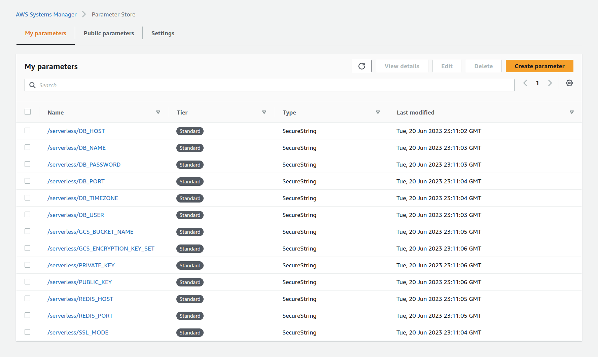

# Goal
Develop a Python automation tool that can be used to upload all the secrets from a .env file to AWS (bulk upload). The script should also be able to overwrite the data if changed.

## Thought Process:
- With the file contents focused on key-value pair, the two services that will be best suited are **AWS Systems Manager Parameter Store (AWS SSM Parameter Store)** and **AWS DynamoDB**
    -  Considerations to keep in mind:
        - Simplicity: AWS Systems Manager Parameter Store is a simpler and more lightweight solution compared to DynamoDB. It provides a straightforward key-value storage system without the need for defining tables, schemas, or complex querying.
        - Cost: Parameter Store is generally more cost-effective for storing and retrieving simple key-value pairs like environment variables. DynamoDB, on the other hand, is a fully managed NoSQL database service with more features, scalability options, and potentially higher costs.
        - Performance: If you require high-performance read and write operations on your environment variables, DynamoDB can provide greater scalability and throughput. However, for most use cases involving environment variables, Parameter Store's performance is sufficient.
        - Security and Encryption: Both Parameter Store and DynamoDB provide encryption options. However, Parameter Store has native integration with AWS Key Management Service (KMS), allowing you to easily encrypt and manage the keys used for parameter encryption.
    Considering the simplicity, cost-effectiveness, and suitability for storing environment variables, AWS Systems Manager Parameter Store is a preferred choice. It provides an easy-to-use, secure, and efficient solution specifically designed for managing configuration data, including environment variables.
- **AWS Systems Manager Paramter Store** stores text using String, StringList, and SecureString datatypes. The env file contains files with secrets that ought to be encrypted with **AWS Key Management System (AWS KMS)**
    - **AWS KMS** is designed for creating and controlling keys used to encrypt data in AWS services and applications. It primarily focuses on key management and cryptographic operations.
- The IAM user configured on the workstation/machine should have appropriate permissions to AWS SSM Parameter Store and KMS services.

## Prerequisite
- Install [python3](https://www.python.org/downloads/)
- Install pip3 based on your os 
    - Confirm installation of pip3: `$ pip3 --version`
    - Install dependencies: `$ pip3 install -r requirements.txt`
- Install [awscli](https://docs.aws.amazon.com/cli/latest/userguide/getting-started-install.html)
- IAM user created on AWS Management Console should have CRUD permissions for AWS KMS and SSM
    - [Walkthrough of steps from ChatGPT](https://chat.openai.com/share/ea30fbca-f879-449b-9cdc-466d4e84abf3)

## Project Directory Structure:

```
.
├── app.py
├── bonus
│   ├── multi_to_single.py
│   └── single_to_multi.py
├── configs
├── README.md
├── requirements.txt
└── snapshot.png
```

## Steps
1. Clone this repo and navigate to the `ssm-parameter-ops`
```
$ git clone https://github.com/Wach-E/ssm-parameter-ops.git
$ cd ssm-parameter-ops/
``` 

2. Configure the local workstation with IAM user credentials
```
$ aws configure
----
AWS ACCESS KEY ID: $iamUserAccessKeyId
AWS_SECRET_ACCESS_KEY: $iamUsersecretKey
```

3. Create a .env file from configs/sample.txt
```
mv configs/sample.txt .env
```
You can modify this file based on your preference.

4. Look through the tool description
```
python3 app.py -h
---
usage: app.py [-h] first_operation [second_operation]

SSM Automation Tool used to list current parameters and bulk upload of .env file in/to AWS SSM Parameter
Store

positional arguments:
  first_operation   list all parameters in AWS SSM Parameter Store
  second_operation  upload config keypairs to AWS SSM Parameter Store

options:
  -h, --help        show this help message and exit
```
The first argument is mandatory while the second is optional.

5. Principle of operation
```
wach@wach:~/Desktop/serverless-project$ python3 app.py list
Current parameters...
+--------+--------+-----------+
| Name   | Type   | Version   |
+========+========+===========+
+--------+--------+-----------+
wach@wach:~/Desktop/serverless-project$ python3 app.py upload list
Uploading config...
Parameter '/serverless/DB_HOST' added successfully.
Parameter '/serverless/DB_USER' added successfully.
Parameter '/serverless/DB_NAME' added successfully.
Parameter '/serverless/DB_PASSWORD' added successfully.
Parameter '/serverless/DB_PORT' added successfully.
Parameter '/serverless/SSL_MODE' added successfully.
Parameter '/serverless/DB_TIMEZONE' added successfully.
Parameter '/serverless/REDIS_HOST' added successfully.
Parameter '/serverless/REDIS_PORT' added successfully.
Parameter '/serverless/GCS_BUCKET_NAME' added successfully.
Parameter '/serverless/GCS_ENCRYPTION_KEY_SET' added successfully.
Parameter '/serverless/PRIVATE_KEY' added successfully.
Parameter '/serverless/PUBLIC_KEY' added successfully.
Current parameters...
+------------------------------------+--------------+-----------+
| Name                               | Type         |   Version |
+====================================+==============+===========+
| /serverless/DB_HOST                | SecureString |         1 |
+------------------------------------+--------------+-----------+
| /serverless/DB_NAME                | SecureString |         1 |
+------------------------------------+--------------+-----------+
| /serverless/DB_PASSWORD            | SecureString |         1 |
+------------------------------------+--------------+-----------+
| /serverless/DB_PORT                | SecureString |         1 |
+------------------------------------+--------------+-----------+
| /serverless/DB_TIMEZONE            | SecureString |         1 |
+------------------------------------+--------------+-----------+
| /serverless/GCS_ENCRYPTION_KEY_SET | SecureString |         1 |
+------------------------------------+--------------+-----------+
| /serverless/PRIVATE_KEY            | SecureString |         1 |
+------------------------------------+--------------+-----------+
| /serverless/PUBLIC_KEY             | SecureString |         1 |
+------------------------------------+--------------+-----------+
| /serverless/REDIS_HOST             | SecureString |         1 |
+------------------------------------+--------------+-----------+
| /serverless/SSL_MODE               | SecureString |         1 |
+------------------------------------+--------------+-----------+
| /serverless/DB_USER                | SecureString |         1 |
+------------------------------------+--------------+-----------+
| /serverless/GCS_BUCKET_NAME        | SecureString |         1 |
+------------------------------------+--------------+-----------+
| /serverless/REDIS_PORT             | SecureString |         1 |
+------------------------------------+--------------+-----------+
```



## Bonus section
The private key for Openssh as shown in the configs/.test.env appears in a single line. This approach was implemented as the AWS SSM Parameter store takes configs per line thus, with Python. The script used to convert this key from multi-line to single line can be found in [multi_to_single.py](bonus/multi_to_single.py) file and the reverse script can be found in [single_to_multi.py](bonus/single_to_multi.py) file.
